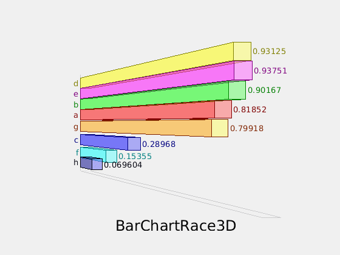
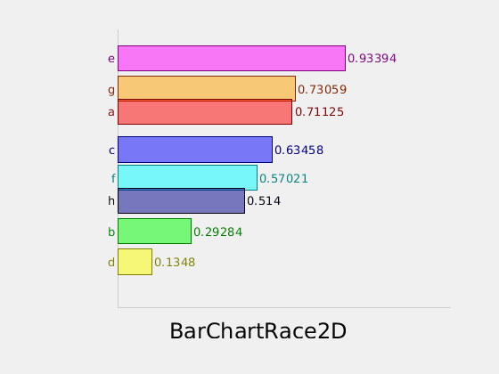

# BarChartRace3D
It is all about data and it is all about presentation. BarChartRace is a popular way to visualize change of data over time. To further impress your audiences, a 3D BarchartRace can help you to present your points with great power. See the following sample animation Gif's generated by BarChartRace3D. 

Refresh your browser to see the animation effect of the
sample gifs below.
## 3D sample output

## 2D sample output

## Sample and Demo
Run testBCR3D for a demo. From this folder

`testBCR3D`

View testBCR3D for sample code.

## Usage

### Construct a BarChartRace3D
Call the constructor to create a BarChartRace3D object

`bcr3 = BarchartRace3D();`

### Optional configurations
These are optional configurations. If not set, the default will be used.

#### labels
Set the labels for the bars.

`bcr3.labels = {'Bar1', 'Bar2', 'Bar3'};`

#### 2D/3D
Default to be 2D. Show 3D by setting this

`bcr3.show3D=true;`

#### output file name
Default to be BarChartRace3D.gif. Note only animation GIF out put is supported.
Change to another filename by setting

`bcr3.outfile = tmp.gif`

#### title
Default to be empty.

`bcr3.title = Title`

#### color for each bar
It has builtin (default) colors. If you want to set the color, you can do this to set 3 colors (R, G, B)
for example. If colors defined below is less than the bars, these colors will be 
reused. For this example, the forth bar will use R again.

`bcr3.colors = [1 0 0; 0 1 0; 0 0 1];`

#### positive only
BarChartRace3D handles positive and negative data by default for 2D mode. 
If you know all the data is positive, you can set the following, and then
BarChartRace3D will use the whole canvas for showing positive data.
Note 3D mode only handles positive data.

`bcr3.positiveOnly=true;`

### set data and race
The data shall be an nxm array, where n is the number of iterations, and m is the number of bars.

`data = randi(10, 8); bcr3.race(data);`

